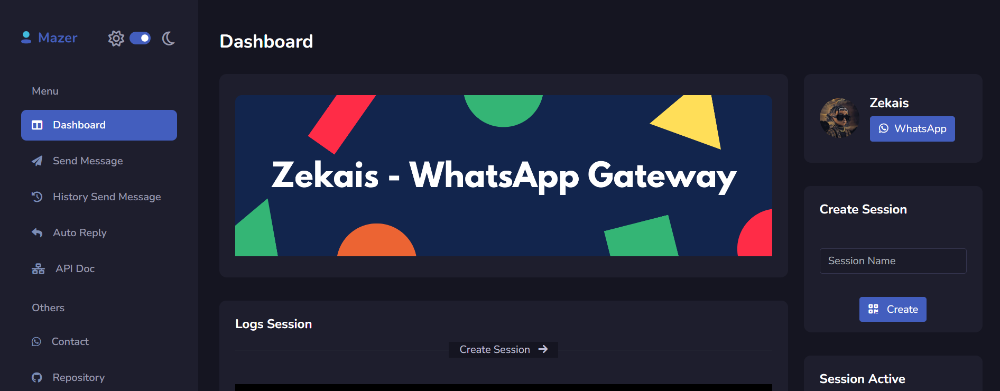

<div align="center">

# 🔱 Fork Information

This repository is a **fork** of the original **[whatsapp-gateway](https://github.com/fawwaz37/whatsapp-gateway)** by **[fawwaz37](https://github.com/fawwaz37)**.

It includes the original features plus the following key enhancements:
- ✅ **Fixed Create Session**: Resolved issues with session creation.
- 🔄 **Multi Session Support**: Added the ability to manage multiple WhatsApp sessions.
- 📁 **Media Library**: Implemented a new system for managing media files.
- 🤖 **Auto Reply with Media**: Enhanced the auto-reply feature to support media attachments.
- 👤 **Multi-User Authentication & Data Isolation**: Added user registration, login, and data isolation, allowing multiple users to manage their WhatsApp sessions and related data independently.

All credit for the original project goes to **[fawwaz37](https://github.com/fawwaz37)**.
</div>

<hr/>
<div align="center">

# **WhatsApp - Gateway**



Simple WhatsApp Gateway, Built Using Baileys, Express, Sequelize + [Mazer](https://github.com/zuramai/mazer)

</div>

<p align="center">
<a href="https://github.com/fawwaz37/whatsapp-gateway/stargazers" target="_blank"></a>
<a href="https://github.com/fawwaz37/whatsapp-gateway/network/members" target="_blank"></a>
</p>

# Note

If you want to **request a feature**, contact my number wa.me/6287715579966

Because there are no other features added to this free repo

# Installation

Requirements

-   [Node.js](https://nodejs.org/en/) (Version 18.x recommended, see `.env` for specific version compatibility if issues arise with Baileys)
-   [Git](https://git-scm.com/downloads)
-   [VS Code](https://code.visualstudio.com/download) or Any Text Editor
-   A MySQL database server.

## Cloning this repo

```cmd
> git clone https://github.com/fawwaz37/whatsapp-gateway.git
> cd whatsapp-gateway
```

Use `code .` to open file in VS Code

```cmd
> code .
```

## Editing the file

`.env` Configurations

```env

# Listening Host - socket
HOST=http://localhost:8080

# Default session name
SESSION_NAME=session_1

# If AUTO_START=y, Auto Start Session With Default name
AUTO_START=n

# It doesn't need to be replaced, it's okay
PREFIX=.
SESSION_PATH=./session
LOG_PATH=./public/log

# Configure the database, fill it with your own
DB_NAME=wa-gateway
DB_USER=root
DB_PASSWORD=
DB_HOST=localhost
DB_PORT=3306
DB_DIALECT=mysql

```

## Installing the dependencies

```cmd
> npm install
```

## Running App

```cmd
> npm start
```

**After Start Database and Table Auto Create**

Then Browse http://localhost:YOUR_PORT (e.g., http://localhost:8080). You will be redirected to the login page.

### User Authentication

This version of the WhatsApp Gateway includes multi-user authentication.

1.  **Registration**: New users must register an account via the "Register" link on the login page. You will need to provide a username, email, and password.
2.  **Login**: Existing users can log in with their username and password.
3.  **Data Isolation**: Once logged in, all data including WhatsApp sessions, media files, auto-reply configurations, and message history will be isolated to your user account. You will only be able to see and manage your own data.


## API Documentation & Authentication

The original API documentation can be found here: <a target="_blank" href="https://documenter.getpostman.com/view/16528402/VVXC3EjU">POSTMAN</a>.

**Important API Authentication Update:**

With the introduction of user authentication, **all API routes are now protected and require authentication.**

-   **Authentication Method**: API authentication is handled via session cookies. To use the API, you must first log in through the web dashboard. Your API client (e.g., Postman, curl, custom scripts) must then include the session cookie (usually named `connect.sid`) in its requests to the API endpoints.
-   **How to obtain the session cookie**:
    1.  Log in to the dashboard via a web browser.
    2.  Use your browser's developer tools to inspect the cookies sent with requests to the backend (e.g., when navigating dashboard pages or making API calls from the dashboard's "Send Message" page).
    3.  Copy the value of the `connect.sid` cookie (or the equivalent session cookie name if it differs).
    4.  Include this cookie in the `Cookie` header of your API requests. For example: `Cookie: connect.sid=your_session_cookie_value_here`
-   **Unauthorized Access**: If you attempt to access a protected API route without a valid session cookie, the API will respond with a `401 Unauthorized` error and a JSON message indicating that authentication is required.

Future versions might include token-based authentication for more convenient API usage, but currently, session-based authentication is used.
